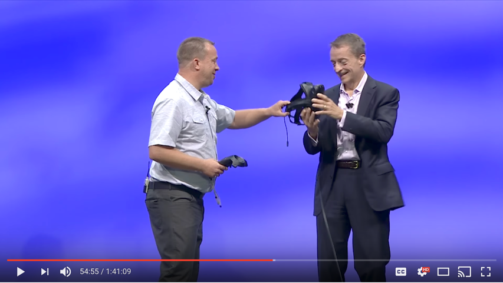

# VMware VR Datacenter Experience

Bring your datacenter to life (virtually), teleport to different locations, pick up your virtual machines to find out more information and drop them in the trash can to delete them.

## Demo
Check out the below video where Alan Renouf (Sr. Product Line Manager) walks Pat Gelsinger (VMware CEO) through the VR Datacenter Experience.

## Stay in contact
[Join VMware Code and #VR channel on slack and ask questions here!](https://code.vmware.com/slack/)

## Download and try

### Prerequisites

* [HTC Vive](https://www.vive.com/us/)
* [vCenter Server 6.5](https://my.vmware.com/web/vmware/info/slug/datacenter_cloud_infrastructure/vmware_vsphere/6_5) or greater
* A build of this project from the [releases page](https://github.com/vmware/vr-dc-ex/releases)
* A config file will be created in %userprofile%\appdata\locallow\vmware\vr datacenter experience\config.ini the first time you run the app, edit this file to store your connection details to your vCenter 6.5 server.
